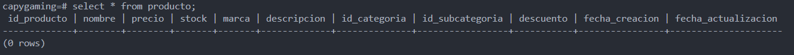
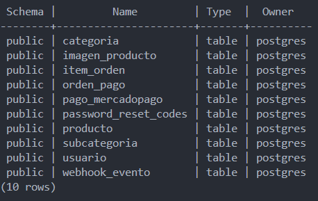
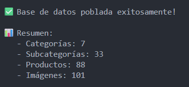
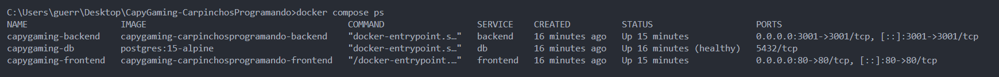

🎮 **E-Commerce de productos gamer.**

## 🔹 Descripción

**CapyGaming** es tu tienda online de confianza para todo lo relacionado con el mundo gamer. Encuentra lo último en hardware, periféricos y accesorios para potenciar tu experiencia de juego.

**Visitanos:**  [Capygaming](https://capygaming-frontend-uffp.onrender.com/) ✨

---

## 🚀 Instalación y Configuración

### 📋 Requisitos Previos

Antes de comenzar, asegúrate de tener instalado:

- **Docker Desktop** ([Descargar aquí](https://www.docker.com/products/docker-desktop))

**Nota importante:** Con Docker **NO necesitas instalar** Node.js, npm, nodemon ni ninguna dependencia. Todo se instala automáticamente dentro de los contenedores.

### 📦 Pasos de Instalación

#### 1. Clonar el Repositorio

```bash
git clone https://github.com/PowerSystem2024/CapyGaming-CarpinchosProgramando.git
cd CapyGaming-CarpinchosProgramando
```

#### 2. Configurar Variables de Entorno

Copia el archivo de ejemplo y configúralo con tus credenciales:

```bash
cp .env.example .env
```

Edita el archivo `.env` y completa las siguientes variables obligatorias:

```env
# Base de datos (puedes dejar los valores por defecto)
POSTGRES_USER=postgres
POSTGRES_PASSWORD=admin
POSTGRES_DB=capygaming

# JWT Secret (genera uno único con el comando de abajo)
JWT_SECRET=tu-jwt-secret-aqui

# Credenciales de MercadoPago (modo TEST)
MERCADOPAGO_ACCESS_TOKEN=APP_USR-tu-access-token-aqui
MERCADOPAGO_PUBLIC_KEY=APP_USR-tu-public-key-aqui
MERCADOPAGO_WEBHOOK_SECRET=tu-webhook-secret-aqui

# URLs (para Docker local)
FRONTEND_URL=http://localhost
BACKEND_URL=http://localhost:3001

# ============================================
# CONFIGURACIÓN DE VALIDACIÓN DE WEBHOOKS
# ============================================
# Solo permitir webhooks sin firma si está en desarrollo Y esta variable es true
# NUNCA activar en producción
ALLOW_UNSIGNED_WEBHOOKS=false

# Email
EMAIL_USER=quirozarielezequiel@gmail.com
EMAIL_PASS=kywuvenezpinyfnl # Nombre de aplicación: Capy-Gaming
```

**Generar JWT Secret:**

```bash
node -e "console.log(require('crypto').randomBytes(32).toString('hex'))"
```

**Obtener credenciales de MercadoPago:**

1. Crear cuenta en [MercadoPago](https://www.mercadopago.com.ar) Developers
2. Ir al [Panel de Desarrolladores](https://www.mercadopago.com.ar/developers/panel/app)
3. Crear una aplicación
4. Copiar las credenciales de **TEST** (empiezan con `APP_USR-`)

#### 3. Iniciar Docker Desktop

Asegúrate de que **Docker Desktop esté ejecutándose** antes de continuar.

#### 4. Levantar los Contenedores

Ejecuta el siguiente comando en la raíz del proyecto. Es muy importante tener configurado el archivo `.env`:

```bash
docker-compose up -d
```

Este comando:

- Crea y configura la base de datos PostgreSQL
- Inicializa las tablas y estructura de la BD
- Levanta el backend (Node.js + Express)
- Construye y levanta el frontend (Vue.js)

##### Verificar que se crearon las tablas de la base de datos: En otra terminal ejecutar:

`docker exec -it capygaming-db psql -U postgres -d capygaming`

##### para probar que se creó la tabla productos ejecutamos la siguiente query despues del #:

`SELECT * FROM producto;`

##### Si se creó la tabla, veremos la tabla vacía.



##### Si queremos ver todas las tablas en psql, ejecutamos despues del #:

`\dt`

Y se veran todas las tablas:



#### ⏱️ **Tiempo de espera:** Aproximadamente 2-3 minutos para que se rendericen todos los productos en la base de datos.

##### Vamos a poblar la tabla con productos:

En otra terminal ejecutamos:

`docker-compose exec backend nodebd/seedProducts.js`



Podemos entrar nuevamente a psql y verificar que hay productos en la tabla:

**`docker exec -it capygaming-db psql -U postgres -d capygaming`**

#### 5. Verificar que Todo Funcione

Verifica el estado de los contenedores:

```bash
docker-compose ps
```

Todos los servicios deben estar en estado `Up` (corriendo).



### 🌐 Acceder a la Aplicación

Una vez que los contenedores estén corriendo:

- **Frontend:** [http://localhost](http://localhost)
- **Backend API:** [http://localhost:3001](http://localhost:3001)
- **Base de datos:** `localhost:5432` (acceso interno)

### 🛑 Detener el Proyecto

Para detener los contenedores:

```bash
docker-compose down
```

Para detener y eliminar volúmenes (⚠️ borrará la base de datos):

```bash
docker-compose down -v
```

### 🔧 Solución de Problemas

**Error: "Cannot connect to the Docker daemon"**

- Asegúrate de que Docker Desktop esté ejecutándose

**Error: "Port already in use"**

- Verifica que los puertos 80, 3001 y 5432 no estén siendo usados por otras aplicaciones

**Los productos no aparecen:**

- Espera 2-3 minutos después de `docker-compose up`
- Revisa los logs: `docker-compose logs backend`

**Error de MercadoPago:**

- Verifica que estés usando credenciales de TEST (empiezan con `APP_USR-`)
- Asegúrate de haber configurado correctamente el `.env`

---

## 🛒 Características

- 🎧 Productos destacados por categorías (monitores, notebooks, procesadores, etc.)
- 💳 Pago seguro con MercadoPago
- 🔍 Explorador de categorías y catálogo completo
- 🏷️ Ofertas y promociones exclusivas
- 📦 Envíos rápidos y garantía oficial
- ⚡ Cuotas sin interés
- 📝 Registro y login de usuarios
- 🛍️ Carrito de compras funcional

## 🖥️ Tecnologías

Estas son las tecnologías utilizadas en este proyecto:

<div style="display: flex; gap: 15px; align-items: center;">
  
  
  
  
  
  
  
</div>

---

##### **¡Únete a la comunidad CapyGaming!**

Disfruta de tus juegos con los mejores productos y el respaldo de Carpinchos Programando.

Para mas información visitá nuestra [Wiki](https://github.com/PowerSystem2024/CapyGaming-CarpinchosProgramando/wiki)
