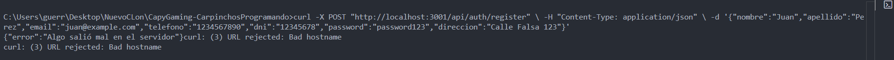

# Testing Manual - Auth API

## Base URL

```
http://localhost:3001
```

## Endpoints Disponibles

### 1. POST /api/auth/register - Registro de usuario

**Descripción:** Registra un nuevo usuario en el sistema

```bash
curl -X POST "http://localhost:3001/api/auth/register" \
  -H "Content-Type: application/json" \
  -d '{
    "nombre": "Juan",
    "apellido": "Perez",
    "email": "juan.perez.test@example.com",
    "telefono": "1234567890",
    "dni": "12345678",
    "password": "password123",
    "direccion": "Calle Falsa 123"
  }'
```

**Thunder Client:**


**Respuesta esperada:**

- Status: 201
- Token JWT
- Datos del usuario (sin contraseña)


**Casos de error a testear:**

```bash
# Usuario duplicado (mismo email o DNI)
curl -X POST "http://localhost:3001/api/auth/register" \
  -H "Content-Type: application/json" \
  -d '{
    "nombre": "Juan",
    "apellido": "Perez",
    "email": "juan.perez.test@example.com",
    "telefono": "1234567890",
    "dni": "12345678",
    "password": "password123",
    "direccion": "Calle Falsa 123"
  }'

# Datos faltantes
curl -X POST "http://localhost:3001/api/auth/register" \
  -H "Content-Type: application/json" \
  -d '{
    "nombre": "Juan"
  }'
```

---

### 2. POST /api/auth/login - Login de usuario

**Descripción:** Autenticación de usuario existente

```bash
curl -X POST "http://localhost:3001/api/auth/login" \
  -H "Content-Type: application/json" \
  -d '{
    "email": "juan.perez.test@example.com",
    "password": "password123"
  }'
```

**Thunder Client: Respuesta Exitosa (200)**


**Respuesta esperada:**

- Status: 200
- Token JWT
- Datos del usuario

**Credenciales Inválidas:**


**Casos de error a testear:**

```bash
# Credenciales incorrectas - email
curl -X POST "http://localhost:3001/api/auth/login" \
  -H "Content-Type: application/json" \
  -d '{
    "email": "noexiste@example.com",
    "password": "password123"
  }'

# Credenciales incorrectas - password
curl -X POST "http://localhost:3001/api/auth/login" \
  -H "Content-Type: application/json" \
  -d '{
    "email": "juan.perez.test@example.com",
    "password": "wrongpassword"
  }'
```

---

### 3. GET /api/auth/profile - Obtener perfil (REQUIERE TOKEN)

**Descripción:** Obtiene el perfil del usuario autenticado

```bash
# Primero hacer login para obtener token
TOKEN="tu_token_aqui"

curl -X GET "http://localhost:3001/api/auth/profile" \
  -H "Content-Type: application/json" \
  -H "Authorization: Bearer $TOKEN"
```

**Thunder Client: Respuesta Exitosa (200)**


**Respuesta esperada:**

- Status: 200
- Datos del usuario


**Casos de error a testear:**

```bash
# Sin token
curl -X GET "http://localhost:3001/api/auth/profile" \
  -H "Content-Type: application/json"

# Token inválido
curl -X GET "http://localhost:3001/api/auth/profile" \
  -H "Content-Type: application/json" \
  -H "Authorization: Bearer token_invalido"
```

---

### 4. POST /api/auth/forgot-password - Recuperar contraseña

**Descripción:** Solicita recuperación de contraseña

```bash
curl -X POST "http://localhost:3001/api/auth/forgot-password" \
  -H "Content-Type: application/json" \
  -d '{
    "email": "juan.perez.test@example.com"
  }'
```

**Respuesta esperada:**

- Status: 200
- Mensaje genérico (por seguridad)


---

### 5. POST /api/auth/logout - Cerrar sesión (REQUIERE TOKEN)

**Descripción:** Cierra la sesión del usuario

```bash
# Usar token obtenido del login
TOKEN="tu_token_aqui"

curl -X POST "http://localhost:3001/api/auth/logout" \
  -H "Content-Type: application/json" \
  -H "Authorization: Bearer $TOKEN"
```

**Respuesta esperada:**

- Status: 200
- Mensaje de sesión cerrada


---

## Flujo Completo de Testing

### Paso 1: Registrar usuario

```bash
curl -X POST "http://localhost:3001/api/auth/register" \
  -H "Content-Type: application/json" \
  -d '{
    "nombre": "Test",
    "apellido": "User",
    "email": "test.user@example.com",
    "telefono": "9876543210",
    "dni": "87654321",
    "password": "testpass123",
    "direccion": "Test Street 456"
  }'
```

### Paso 2: Login con el usuario registrado

```bash
curl -X POST "http://localhost:3001/api/auth/login" \
  -H "Content-Type: application/json" \
  -d '{
    "email": "test.user@example.com",
    "password": "testpass123"
  }'
```

### Paso 3: Usar el token para acceder a perfil

```bash
# IMPORTANTE: Reemplazar YOUR_TOKEN con el token del paso 2
curl -X GET "http://localhost:3001/api/auth/profile" \
  -H "Content-Type: application/json" \
  -H "Authorization: Bearer YOUR_TOKEN"
```

**Thunder Client - Flujo completo:**



### Paso 4: Logout

```bash
curl -X POST "http://localhost:3001/api/auth/logout" \
  -H "Content-Type: application/json" \
  -H "Authorization: Bearer YOUR_TOKEN"
```

**Thunder Client - Logout:**


---

## Resultados de Testing

### Test 1: Registro

- [X] Status: 200
- [X] Token recibido:
- [X] Usuario creado:
- [X] Error en duplicados:

### Test 2: Login

- [X] Status: 200
- [X] Token recibido:
- [X] Error en credenciales incorrectas:

### Test 3: Profile

- [X] Status con token válido: 200
- [X] Error sin token:
- [ ] Error con token inválido:

### Test 4: Forgot Password

- [ ] Status: 200
- [ ] Mensaje recibido:

### Test 5: Logout

- [X] Status: 200
- [ ] Sesión cerrada:
