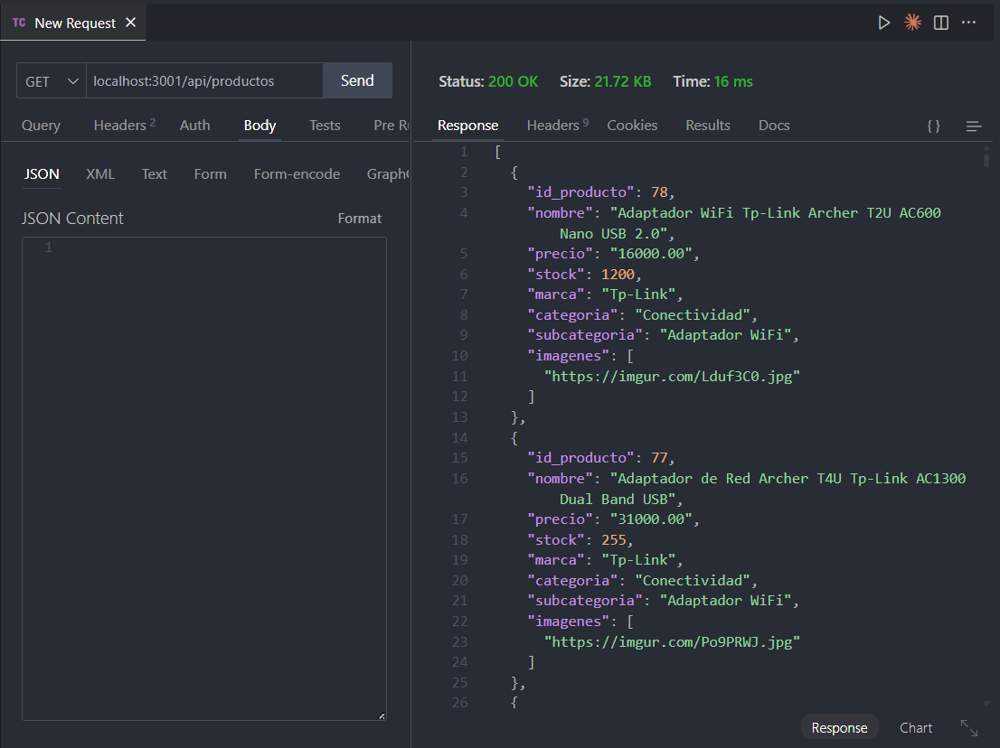
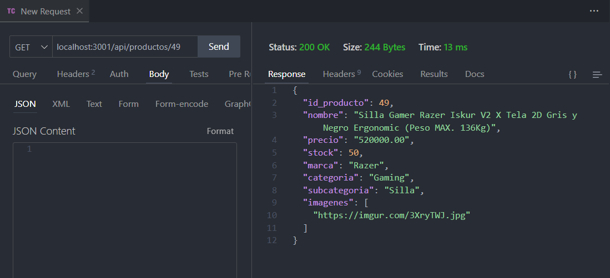
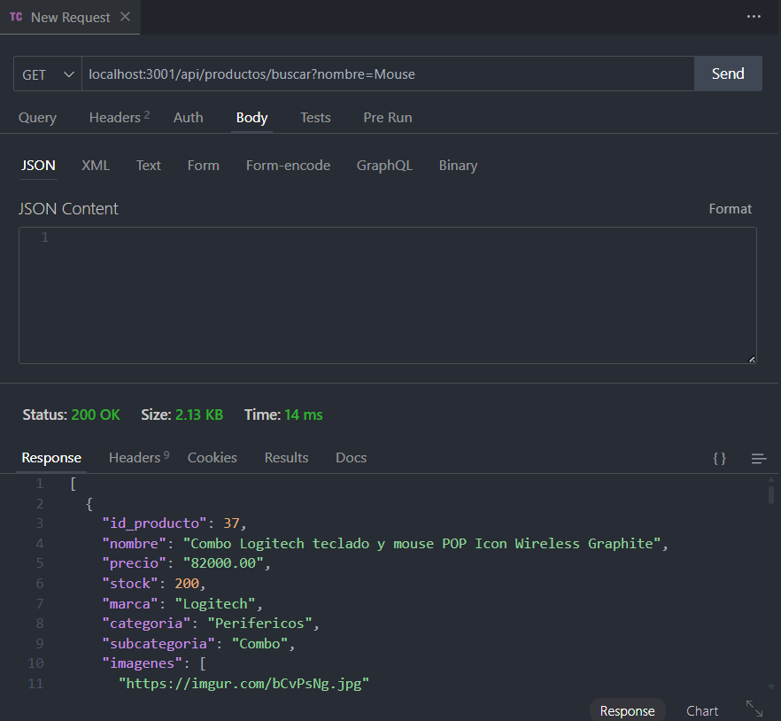
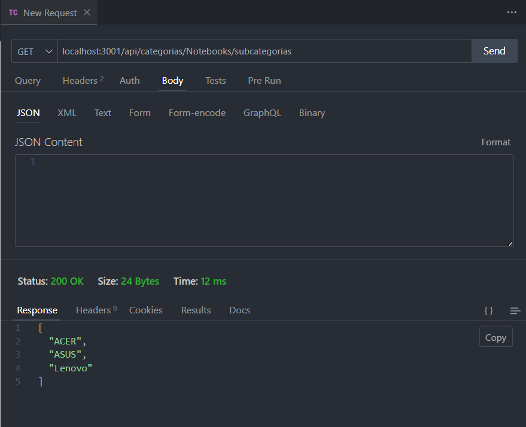

# Testing Manual - Products API

## Base URL

```
http://localhost:3001
```

## Endpoints Disponibles

### 1. GET /api/productos - Obtener todos los productos

**Descripción:** Obtiene listado completo de productos

```bash
curl -X GET "http://localhost:3001/api/productos" \
  -H "Content-Type: application/json"
```

**Thunder Client:**



**Respuesta esperada:** Array de productos con imágenes, categorías, subcategorías



---

### 2. GET /api/productos?categoria=X - Filtrar por categoría

**Descripción:** Filtra productos por categoría específica

```bash
# Ejemplo: categoría gaming
curl -X GET "http://localhost:3001/api/productos?categoria=gaming" \
  -H "Content-Type: application/json"
```

**Parámetros:**

- `categoria` (query param): nombre de la categoría

---

### 3. GET /api/productos?categoria=X&subcategoria=Y - Filtrar por categoría y subcategoría

**Descripción:** Filtra productos por categoría Y subcategoría

```bash
# Ejemplo: gaming > pc
curl -X GET "http://localhost:3001/api/productos?categoria=gaming&subcategoria=pc" \
  -H "Content-Type: application/json"
```

**Parámetros:**

- `categoria` (query param): nombre de la categoría
- `subcategoria` (query param): nombre de la subcategoría

---

### 4. GET /api/productos/:id - Obtener producto por ID

**Descripción:** Obtiene detalle de un producto específico

```bash
# Ejemplo: producto con ID 1
curl -X GET "http://localhost:3001/api/productos/1" \
  -H "Content-Type: application/json"
```

**Parámetros:**

- `id` (path param): ID del producto

**Casos de error a testear:**

```bash
# Producto inexistente
curl -X GET "http://localhost:3001/api/productos/99999" \
  -H "Content-Type: application/json"
```

---

### 5. GET /api/productos/buscar?nombre=X - Buscar productos por nombre

**Descripción:** Busca productos que contengan el término en el nombre

```bash
# Ejemplo: buscar "cyber"
curl -X GET "http://localhost:3001/api/productos/buscar?nombre=cyber" \
  -H "Content-Type: application/json"
```

**Thunder Client:**



**Parámetros:**

- `nombre` (query param): término de búsqueda

**Casos de error a testear:**

```bash
# Búsqueda sin parámetro
curl -X GET "http://localhost:3001/api/productos/buscar" \
  -H "Content-Type: application/json"

# Búsqueda vacía
curl -X GET "http://localhost:3001/api/productos/buscar?nombre=" \
  -H "Content-Type: application/json"
```

---

### 6. GET /api/categorias/:nombre/subcategorias - Obtener subcategorías

**Descripción:** Obtiene todas las subcategorías de una categoría

```bash
# Ejemplo: subcategorías de gaming
curl -X GET "http://localhost:3001/api/categorias/gaming/subcategorias" \
  -H "Content-Type: application/json"
```

**Thunder Client:**



**Parámetros:**

- `nombre` (path param): nombre de la categoría

**Casos de error a testear:**

```bash
# Categoría inexistente
curl -X GET "http://localhost:3001/api/categorias/inexistente/subcategorias" \
  -H "Content-Type: application/json"
```

---

## Resultados de Testing

### Test 1: GET /api/productos

- [ ] Status:
- [X] Productos devueltos:
- [X] Estructura correcta:

### Test 2: Filtro por categoría

- [ ] Status:
- [X] Productos filtrados correctamente:

### Test 3: Filtro categoría + subcategoría

- [ ] Status:
- [X] Filtros aplicados correctamente:

### Test 4: GET /api/productos/:id

- [ ] Status:
- [X] Producto devuelto:
- [X] Error 404 para ID inexistente:

### Test 5: Búsqueda por nombre

- [ ] Status:
- [X] Búsqueda funcionando:
- [X] Error 400 sin parámetro:
